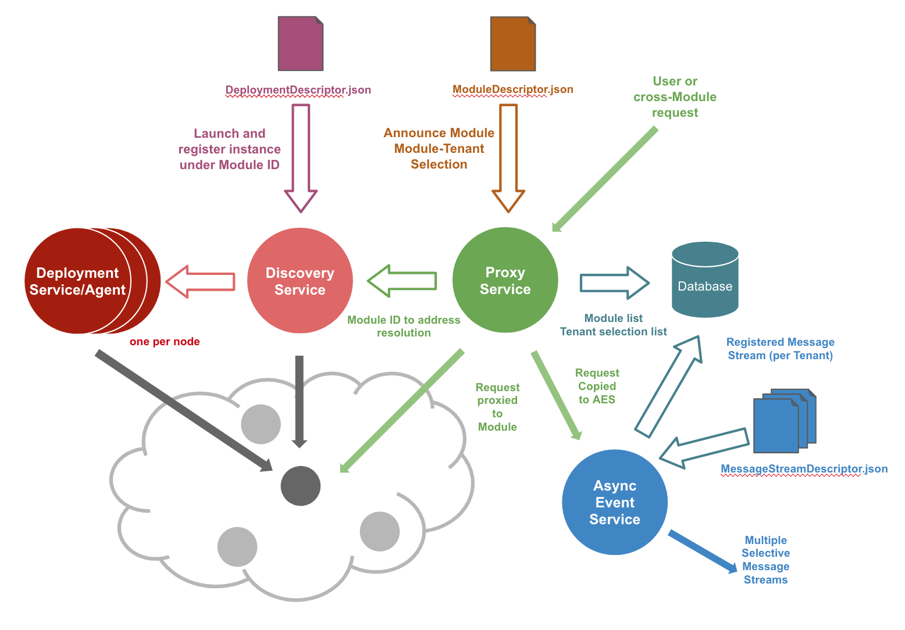
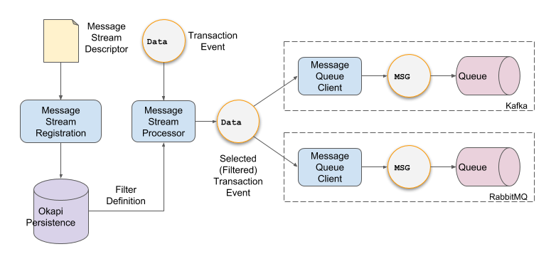

- Start Date: 2018-07-16
- RFC PR: (leave this empty)
- FOLIO Issue: (leave this empty)

# RFC: Okapi Asynchronous Event Service  (AES).

## Summary

The Okapi Asynchronous Event Service (AES) provides the ability to efficiently push out selective event messages from within Okapi. The service allows a preconfigured message stream to originate within Okapi and be delivered asynchronously to a predefined destination. The trigger for sending the message is initiated from Okapi and not dependent on an external request to do so. AES delivers message events out-of-band from the transactions that produce them and therefore does not present latency and scalability issues.

## Motivation

This mechanism provides the ability to initiate asynchronous data streams directly from Okapi. Effectively, this provides Okapi with a “push” capability. Furthermore, the mechanism is efficient, as it can be achieved out-of-band from the normal transaction processing. 

There are many features and capabilities that can make use of an Okapi AES these include:

* Auditing - auditable events would be pushed out as they occur for further processing
* Analytics - events intended for analytics and other reporting would be pushed out into a data lake.
* Folio Consistency Resolution - synchronization events would be pushed out from microservices to be consumed by other subscribed microservices to synchronize their storage copy.
* Union Catalogs / Community Zones - synchronization events intended to be synchronized from multiple Folio instances and tenants
* Hybrid Folio - provides coordination event between a centrally hosted Folio cloud instance and a satellite local Folio instance used to host selective apps and custom code.
* Workflow Service - provides events to act as triggers for a workflow service. 
* Monitoring - provides events for system monitoring, operations and security.

The fire-and-forget nature of AES can be used to minimize performance impact of a Folio system. Multiple AES instance can operate in parallel through scaling of Okapi. It does not accumulate increasing latency as might be the case in a serialized alternative.

By design AES is agnostic to the contents and traffic flow of the message streams it provides; Okapi does not become burdened with business logic and thus remains “pure”. This is accomplished by supporting syntactic rules and patterns which determine the selection and flow of qualifying events. By analogy, Okapi is a router and AES implements routing rules.

## Detailed Explanation/Design

Okapi AES is implemented as a distinct internal module within Folio. It sits alongside the existing internal modules such as Deployment, Proxy and Registration. As with all of Folio, AES has tenant context

### Terminology:

**AES Event:** any transaction or time-specific event that occurs within Okapi visibility. This would include any module traffic, as well as Okapi direct requests to internal modules, or system level events visible to Okapi.

**AES Message:** once captured, an AES event becomes an AES message to be delivered to a  message stream. 

**AES Message Stream:** the sequence of related AES messages.

**AES Message Destination:** a configuration of an AES message stream that defines where messages are sent for that stream. This will typically be something like a message queue (e.g. RabbitMQ or Kafka). Okapi provides support for specific queues through the inclusion of the appropriate client. Queue instances are registered (including configuration) in Okapi and thereafter can be used as destinations for Message Streams

**AES Rule:** a syntactic description of what to do with a particular event. This consists of: a mechanism for identifying the event (id or pattern match or regex match); an action to be performed (e.g. ignore, capture, etc..); and a destination (specific message stream)

**AES Message Stream Descriptor:** a document that defines a complete AES Message Stream including all related AES Rule definitions, AES Message Stream.

### Scope

The Okapi AES Rule is entirely a backend feature that exists within Okapi. Other systems integrate with AES for the purposes of providing user interfaces or command-line interfaces are not in scope of this RFC.



### AES Message Stream Descriptors

A message stream descriptor is a single document which contains the definition for a message stream. This is similar to the Module Descriptor which is a declarative definition of an Okapi module’s capabilities and interfaces. In a similar fashion, the message stream description is expressed in YAML - which is the format from which the RAML of module descriptors is derived. The specific details of the descriptor are still TBD and will emerge from implementation. 

One known element of the message stream descriptor is that it contains an AES Rule. This is used by the AES processor to apply filters to AES transaction events and deliver them to a specific destination (typically a message queue). 

### AES Rules

AES rules provide the selection filter definition for message streams. The rules are included in the message stream descriptors and are parsed by the registration service (see Implementation section below). The result of which is used at runtime to filter incoming events and direct them to appropriate targets (destinations).

The general format of an AES Rule is the following:
```
 <selection-criteria> , <action> , <target>
```

(The choice of delimiter is TDB, the comma character is used here for illustrative purposes only.)

Note that the rule definition is agnostic to the specific queue technology used as well as the wire or message protocol involved. Those are handled behind the abstraction that is a target. Targets will need to be defined and created as part of system configuration.

The registration service will parse the rules and add them to Okapi persistence. There is not need to group them by message stream once they are parsed. Indeed, it may be advantageous to group message rules according to their similarity so that they can be most efficiently applied for filtering transaction events in real-time.

The composition of a message rule is as follows:

**Selection-criteria**

The selection criteria consist of a single Boolean expression that will include (or exclude) individual transactions based on what they match to. The rules support basic Boolean operations (OR, AND, NOT), precedence rules, and Boolean monotone laws (Association, Commutation, Distribution, Identity, Annihilation). The terms of the expression consist of: (1) name-value pairs from HTTP headers; (2) metadata available to Okapi through its discovery service (e.g. a module name or an interface id, identified using a reserved word vocabulary).

The terms of the selection criteria Boolean expression consist of name value pairs. Values are expressed as a string. The initial implementation will support exact matching only and stemming. Stemming (a.k.a “begins with”) is used to match module or version names, while excluding the version numbers that exist on the tail of the string. For example,  `“folio_search-*”` will match `“folio_search-1.1.100088”`. Later versions may introduce support for regular expression matching. 

**Actions**

The action describes what should be done with transactions that match the selection-criteria. In the initial implementation there is only one action available: “publish”. This results in the entirety of the transaction, both Request and Response,  including the bodies, to be packaged into a message. Future iterations may introduce other actions. Those may implement such concepts as broadcasts, broadcasts with exclusions, or synchronization with external systems.

**Targets**

The target specifies the destination of the created message as executed by the action. In the simple case this represents publishing a message to a message queue. In the initial implementation, only the simple case is supported: one message to one message queue. In future implementations it may be possible to support more complex descriptions of targets through the use of target sets (groupings of targets), predefined targets (e.g. “broadcast”), combinatorial rules (including exclusions). 

**Example Message Stream Rule**

The following is a simple rule at will capture all transactions to the mod-users module for tenant with id fs00000001.
```
(x-okapi-tenant=fs00000001 AND MODULENAME=folio_users) , publish , kafka1:topic3
```
* `x-okapi-tenant header` identifies the tenant
* `MODULENAME` is a reserved term name that can be resolved by Okapi 
* `publish` is the only supported action
* `kafka1:topic3` identifies the target to be as Kafka broker registered as `kafka1` and the topic identified as `topic3`. The specific address of the broker can be resolved by the Message Stream Processor.


### Phasing

Okapi AES is a complex and powerful subsystem. This RFC covers the long-term vision of what it is intended to be. The implementation can be accomplished in distinct phases:

**Phase 1 - Basic:** support for a single message stream; tenant filtering; event filtering at the module level; capture action only; JSON events/messages only

**Phase 2 - Multi-stream:** adds support for multiple message streams: 

**Phase 3 - Pattern Matching:** adds simple pattern matching for capture events; support for non-JSON

**Phase 4 - Rules:** adds support for routing rules whereby message can be sent to multiple message streams; support for different actions (e.g. ignore)

**Phase 5 -  Advanced Filtering:** adds regex filtering for event selection.

**Phase 6 - Advanced Protocols:** adds support for high-performance protocols such as protocol buffers (TBD)

### Protocol

AES Message Streams (initially) implement the TCP protocol. This is the preferred protocol for integrating with expected destination systems (e.g. RabbitMQ, Kafka, Prometheus, etc…) Support for additional more specialized and performant protocols could be added later.

The wire or message protocol used is dependent on the choice of specific message queue. Some support multiple standard wire protocols (e.g. RabbitMQ) while others only provide a single proprietary wire protocol (e.g. Kafka). However, the details are abstracted through dedicated the message queue clients. These act as abstraction layers that implement an identical interface for AES - much like a printer driver does for a modern operating system.

### Security

Security is an important consideration for the AES feature since it is both powerful and possibly very disruptive. It has the potential for abuse and violation of multiple security and privacy concerns. Consequently, AES does not expose its configuration settings through API endpoints from Okapi. 

AES does not directly enforce privacy policies relating to Personally Identifiable Information (including GDPR). However, it provides the ability to support the creation of such policies through the use of appropriately defined AES Rules.

### Configuration

Due to security concerns, Okapi provides only a very limited set of API endpoints to the internal AES module. Furthermore, AES must first be activated, which is achieved through a configuration setting. 

Destination targets must first be supported by Okapi through incorporation of a suitable client (e.g. for RabbitMQ or Kafka). If a client is available then specific destination instances can be created which contain the necessary configuration (e.g. server, port number, credentials etc…). Specific destination instances may then be referred to by AES Rules in the definition of Message Streams.

Rules which define message streams must be created declaratively through a Message Stream Descriptor.  Message Stream Descriptors are discovered by the OKAPI AES internal module. They are parsed and interpreted resulting in the creation of a corresponding Message Stream. 

The only API available is the one that can now be used to assign an existing Message Stream to a tenant.

### Dependencies

Okapi AES is an integral part of Okapi and therefore has the same dependencies as Okapi (eg. VertX). 
Additionally, Okapi AES is dependent on:
* Client code (libraries) for supported queues and other Destinations.
* a parser to read the Message Stream Descriptors
* storage location for Message Stream Descriptors
* a distribution channel for Message Stream Descriptors

### Implementation

The implementation of AES consists of three main components.  



#### Registration Service

The message stream registration service is used to interpret the contents of a Message Stream Descriptor and create a corresponding message stream structure. The descriptor contains the metadata used to create the structure. In particular message rules are parsed and the selection criteria extracted for runtime use by the processor service.

The registration service should make use of the same persistence mechanisms used by other parts of Okapi. There is the possibility to implement this as an extension of the existing Okapi module registration or as a separate registration service.

#### MS Processor Service

The message stream processor service is used to intercept transaction events from Okapi’s proxy service and filter out those matching the registered selection criteria message stream rule pat. It will then create a message from the transaction and apply the prescribed action onto the corresponding target. For example it will might take the transaction, format it into a message and publish it to a given message queue. 

#### Message Queue Client(s)

The message queue client is used to pass the selected event transactions in the form of messages to specific message queues. These can be thought of as drivers to a particular type of message queue (e.g. Kafka or RabbitMQ). 

There may be more than one message queue client for a given type of message queue. It may be desirable to implement a separate message queue client for each wire or message protocol. For example, there may be one client for RabbitMQ AMQP and another for RabbitMQ STOMP..

A Folio system should be entirely functional without any message queue clients install - they are optional. In which case their absence will be handled gracefully, even if AES Message Descriptors have been registered and AES rules are present in the system. Conversely, it should be possible to register AES Message Stream Descriptors even if no message queue clients have been configured for the system. The two are independent.

### Related Jira Issues:

* [UXPROD-330](https://issues.folio.org/browse/UXPROD-330)

### Documentation

Okapi AES needs to be fully documented in the relevant places in the existing Okapi documentation. A separate document is needed which describes in detail how AES is to be used.

Additionally, a number of AES Message Stream Descriptors will be created and made available as part of Folio OSS. These will serve both as templates (exemplars for customization or for training) and as simple canned configurations that can be easily used to ease the deployment of  a new Folio system.

### Risks and Drawbacks

Implementation of Okapi AES support is the first attempt to implement a push service for Folio. As such it bears the risk associated with breaking into new areas of functionality. Some of those risks can be mitigated through a phased implementation approach. The phase implementation also helps reduce the risk associated with the overall complexity through the reduced risk of the now smaller scoped and less complex phases.

The Okapi AES serves as an investment into future development for the platform because it provides a preferred implementation for multiple desired features, as listed in the Motivation section above. As with any investment, there may be a shorter path to implementing any one of those features directly, with any number of shortcuts and existing capabilities. However, sooner rather than later, the limitations of implementing such features without underlying push services will become a burden which would likely prove to be more costly in both effort and technical debt.

### Rationale and Alternatives

Fundamentally, this enables a Messaging pattern for the Folio platform. As such it provides a basis from which to build solutions to multiple problems. It allows for the synchronization and reconciliation of data distributed amongst multiple microservices. It also forms the basis for efficiently extracting data in near real-time from a Folio instance towards external systems. It allows coordination between multiple Folio instances.

There exists other patterns which provide solutions to each of those case. For example a Saga pattern for distributed transactions. However, those are typically more complex and more specific to the problems that they solve. The Messaging pattern, and thus the Asynchronous Event Service, offers both a more generally useful approach and a simpler solution.

Some of the problems outlined above could be partially resolved using some of the available features of Okapi. But the limitations of a pull models, pre- and post- handler filters and HTTP protocols will not yield a complete and optimal solution.

## Unresolved Questions

Many details of the implementation remain unspecified at this point. This is deliberate so as not to provide an over-constrained solution. There needs to remain a large degree of freedom in the actual implementation. 

Furthermore, since this is a very different and fundamental capability compared to what is currently available in Folio and Okapi, it is important to engage discussion on the those concepts before investing too much in the implementation details.